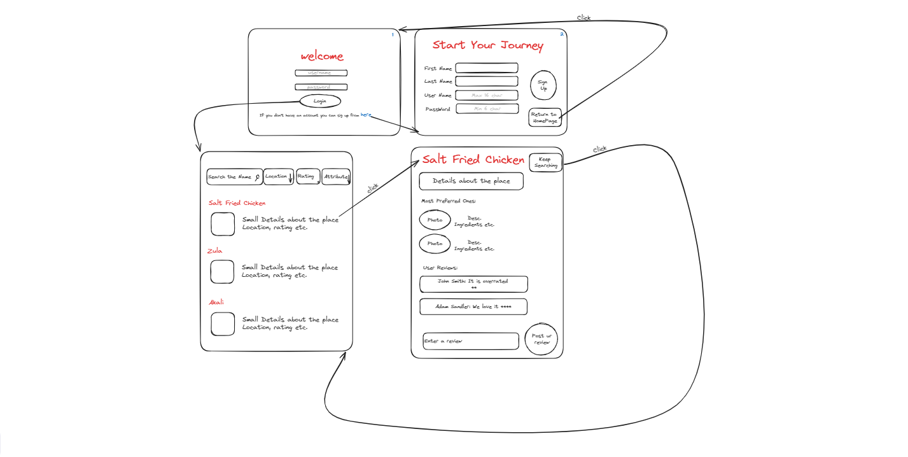

# Cooky

**Welcome to Cooky! This repository contains data and scripts for a website that provides information about various restaurants and eateries in Istanbul, Turkey, along with user ratings and reviews.**

## What can you do with this application?

**1. You need to sign up to explore this delicious application.**

* Write your first and last name.
* Choose an user name and create a strong password.
* You are ready to use Cooky!

**2. If you already have an account just sign in.**
* Write your username and password to sign in.

**3. You can search restaurants by locations!**
   
* Click on the location bar to initiate a search.
* Select your desired location from the dropdown menu (e.g Kadikoy).
* Instantly access a list of renowned restaurants in the chosen area along with their respective reviews.

**4. You can also search restaurants by rating!**
   
* Click on the rating bar.
* Select your desired rating (e.g 4 and Over).
* Explore highly-rated restaurants matching your criteria.

  

**5. Lastly you can review the restaurants!**
   
* Visit the details page of the restaurant you want to review.
* Scroll down to the review section.
* Click on the "Leave a Review" button.
* Rate your dining experience using the provided rating scale and share your thoughts.

  

# The Page Flow Diagram

  

## How to run the application?

**1. Clone the repository.**

git clone https://github.com/egeoruc/Cooky.git

**2. Install Dependencies.**

npm install

**3. Start the Development Server.**

npm start

## Our Group

_This project was a collective effort with each member contributing to various parts, with a focus on specific areas:_

* Ege Oruç
  
  Focused on developing the restaurant page
  
* Şevval Eraslan
  
  Worked on the details page
  
* Fulya Türkmenoğlu
  
  Took part on designing and implementing the homepage and sign up

  
